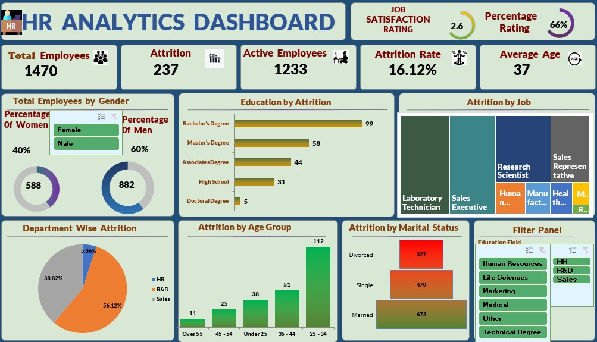
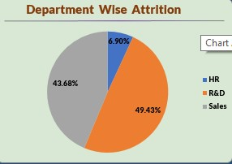
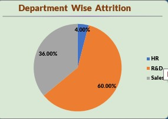

# Human Resource Attrition Analytics
## An Excel project on Leveraging Data to Reduce Attrition Risk and Retain Top Talent

## Introduction
This project entails conducting an in-depth analysis of employee attrition at an imaginary Company X using HR analytics techniques. Human resource analytics has emerged as a crucial function enabling data-driven workforce optimization. It applies analytical techniques to employee data across the talent lifecycle - from recruitment and onboarding to performance management, engagement, retention, and offboarding.
By gathering, integrating, and analyzing HR metrics, organizations can gain a quantified view of workforce productivity, capacity, costs, risks, and opportunities. 
Essentially, HR analytics introduces an evidence-based approach toward strategic human capital management. It allows HR leaders to accurately measure the ROI of various programs, forecast talent needs, identify drivers of employee behavior, optimize processes, and recommend data-backed interventions that enhance workforce capability, agility, and experience.
With fierce competition for skilled talent, it has become imperative for HR to adopt analytics in managing people - the most important asset in a company.
The goal is to provide data-backed recommendations on compensation structuring, career development, managerial coaching, and other areas to minimize regrettable attrition of high-potential employees. Implementing a strategic retention program based on analytical findings can help Company X protect its talent capital and knowledge assets.
### Data source
The data used for this project is dummy data that does not represent any specific company but is used to demonstrate the capabilities of Excel in creating visually appealing, dynamic, and intuitive user-friendly dashboards.
### Dashboard development methodology and Design.
We start by creating a customized background for this project which will make our dashboard more attractive, appealing, and intuitive using PowerPoint.
However, the creation of the background is outside the scope of this project. we shall import one I have already created into Excel and use it.
The dashboard will consist of key performance indicators(KPIs) cards, donut charts, horizontal bar charts, tree maps, pie charts, column charts, funnel charts, and filter panels with filters.

### Dashboard building
Having cleaned, studied, and understood the data, the data is now converted into a table with a data size of about 1471 rows and about 44 columns.
We can use this data to create many dashboards of our choosing and understand employee attrition by the questions we have. Pivot tables are used in the design of the components of this dashboard.
We shall create one dashboard for the purpose of this project that will attempt to answer the questions in the problem statement.

##  Problem statement 
1. __How many active employees does the company have?__
2. __What is the percentage attrition rate by the employees?__
3. __Which gender has the highest attrition rate in this organization?__
4. __What department has the lowest or highest attrition by gender?__
5. __Which age group has the highest employee attrition in this company?__
6. __Which marital status has the lowest attrition?__
7. __Which education field has the highest attrition by gender?__
 
 
### Skills demonstrated.
- I used PowerPoint to create the background for this project
- I entirely used Excel as a tool to create the dashboard.

## A Dynamic, interactive, and intuitive Dashboard demo

## Data analysis and visualization
### Final Dashboard showing human resource attrition at Company X
### Keys findings from the dashboard:
 - Out of the 1470 employees with an average of 37 years that company X has had, 237 of them have left the company at an attrition rate of 16.12%.
 - Company X is fairly dominated by the Male gender whose percentage stands at 60%  of the total employees.
 - The highest number of people who have left the company by education category are bachelor's holders whereas the least number of people who have left the company are doctorate holders.
 - The top 4 job categories with the highest number of people  who have left the company by job description are; Laboratory technicians, Sales executives, Research Scientists, and Sales Representatives respectively.
 - Among all the three departments in company X, the HR department is the one that has the least employee attrition rate whose percentage stands at 5.06%.
 - Attrition at company X  predominantly happens in the middle-aged group of employees of between 25-34 years of age.
 - It can also be noted that the most number of people who have left the company have been married.
   
 ## Further analysis From generated graphs
 Figure1
      
 
 ### key take ways from the generated graphs 

## Conclussion

